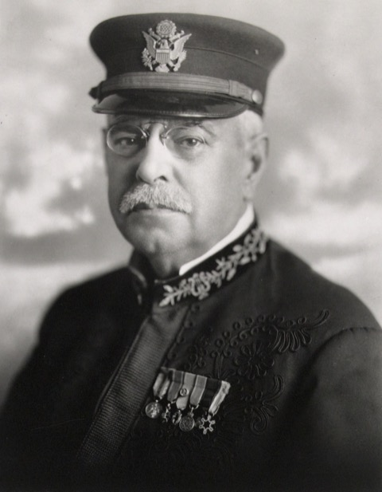

<p align="center"></p>

<p align="center"><strong>Dedicated to John Philip Sousa (1854–1932) — &quot;The March King&quot;<br>Fmr. Director of &quot;The President's Own&quot; United States Marine Band</strong></p>

<p align="center"><em>Sousa led "The President's Own" from 1880–1892 and wrote the American march canon —
<a href="https://en.wikipedia.org/wiki/The_Stars_and_Stripes_Forever">"The Stars and Stripes Forever"</a>
(the National March of the United States), "Semper Fidelis" (the official march of the U.S. Marine Corps),
and "The Washington Post." He invented the sousaphone and, before recording was common, put a marching
band in every American's ear. He built music that a whole ensemble reads off one score — which is exactly
what this project generates: an editable multitrack FL project, not a flat mixdown.</em></p>

<p align="center"><em>Sibling to the <a href="https://github.com/CryptoJones/VibeComposing-Analyzer">Dix (VibeComposing) Analyzer</a>,
which is dedicated to Maj. Brian Dix of "The Commandant's Own" — the two Marine-music namesakes of the As30p toolchain.</em></p>

# FL-Studio-MCP-Server

An **MCP server that lets Claude Code (and any MCP client) interact with FL Studio** —
drive the running DAW and generate/edit FL projects programmatically.

> **Sister project:** the [**Dix (VibeComposing) Analyzer**](https://github.com/CryptoJones/VibeComposing-Analyzer)
> — a native VLC visualizer that *sees* a track's spectrum, key, and loudness. Where the Analyzer **reads**
> a finished mix, this server **writes** the FL project behind it. Both grew out of the
> **As30p** music toolchain, and both are dedicated to a Marine bandmaster.

## Why

FL Studio exposes **no external REST / OSC / AppleScript API**. Its only programmatic
surface is a **built-in Python API** (14 modules, 427+ functions: `transport`, `mixer`,
`channels`, `patterns`, `playlist`, `plugins`, …) intended for MIDI-controller scripts
that run *inside* FL. This project wraps that surface — plus offline project-file
tooling — as clean MCP tools.

## The three API routes

| Route | Module | What it does | Runs | Status |
|-------|--------|--------------|------|--------|
| **A — PyFLP** | `routes/pyflp_route.py` | Read/write `.flp` project files directly (tempo, title, metadata, channel names). | Offline, no FL running | ✅ **implemented** |
| **B — Flapi** | `routes/flapi_route.py` | External client → a server script inside FL → the 427-function API (transport, mixer, channels, hint, eval). | Live, FL open | ✅ **implemented** (needs FL-side setup) |
| **C — Piano Roll** | `routes/script_route.py` | A library of `flpianoroll` scripts, installed into FL's Piano Roll tools menu. | One-off in FL | ✅ **implemented** |

Full breakdown, links, and trade-offs: **[docs/ARCHITECTURE.md](docs/ARCHITECTURE.md)**.

## Route A (PyFLP) — what works today

Route A is the deterministic, offline route: **no FL Studio needs to be running.** New
projects are minted from a bundled copy of FL's own *Empty* template
(`src/fl_studio_mcp/templates/empty.flp`), so every generated `.flp` opens cleanly in FL.

Tools registered by the server:

| Tool | What it does |
|------|--------------|
| `flp_info(path)` | Inspect an `.flp` — FL version, PPQ, tempo, title/artists/genre/comments, channel & pattern names. |
| `flp_create(out_path, title?, tempo?, artists?, genre?, comments?)` | Create a new `.flp` (from the Empty template) with the given metadata. |
| `flp_set_tempo(path, bpm, out_path?)` | Set tempo (BPM). Edits in place, or writes a copy to `out_path`. |
| `flp_set_metadata(path, title?, artists?, genre?, comments?, out_path?)` | Set metadata; only the fields you pass change. |
| `flp_rename_channel(path, index, name, out_path?)` | Rename a channel by 0-based index. |

Plus `ping` (health check) and `routes` (route status).

**Scope, honestly:** Route A v1 covers create-from-template, inspect, and metadata/tempo/
channel-name edits — the surface PyFLP actually supports for round-trip writes. Composing
*new* channels, patterns, and notes from scratch is not exposed by PyFLP's public model
API; that's the job of **Route B (Flapi)**, where FL itself does the note-making. See
[BACKLOG.md](BACKLOG.md).

> **Compatibility note:** PyFLP 2.2.1 can't parse a single event on modern CPython — its
> memberless `EventEnum` trips a `TypeError` in `enum.Enum.__new__` before the `_missing_`
> hook runs. `fl_studio_mcp/_compat.py` installs a tiny, targeted shim that routes the
> lookup back through PyFLP's own resolver, without patching PyFLP's source.

## Route B (Flapi) — live control of a running FL

Route B drives a **running** FL Studio through [Flapi](https://github.com/MaddyGuthridge/Flapi):
an external client talks to a server script inside FL over a virtual MIDI port (macOS
IAC Driver, auto-created), so calls to FL's scripting API hit the live session.

One-time FL-side setup:

```sh
pip install "fl-studio-mcp-server[live]"   # flapi + FL API stubs
# then, via the MCP tool `fl_install_server` (or `python -m flapi install`), and restart FL
```

| Tool | What it does |
|------|--------------|
| `fl_status` | Is the `live` extra installed? Are we connected? (safe — never touches MIDI) |
| `fl_connect` | Connect to a running FL via Flapi (returns FL's API version). |
| `fl_install_server` | Install the Flapi server into FL (`flapi install`); restart FL after. |
| `fl_hint(message)` | Show a hint in FL's panel — the quickest connectivity smoke test. |
| `fl_transport(action)` | `play` / `stop` / `record` / `toggle` the transport. |
| `fl_get_tempo` | Current project tempo (BPM). |
| `fl_mixer(index?, volume?)` | Track count / read a track volume / set a track volume. |
| `fl_channels` | List channel-rack channel names. |
| `fl_eval_expr(expr)` | Escape hatch: evaluate any expression in the live FL (e.g. `patterns.patternCount()`). |

Every Route B tool **degrades gracefully** — with no `live` extra or no running FL, it
returns a structured `{"ok": false, "error": …}` instead of crashing the server.

## Route C (Piano Roll) — a bundled script library

Route C ships ready-made **[Piano Roll scripts](https://www.image-line.com/fl-studio-learning/fl-studio-online-manual/html/pianoroll_scripting_api.htm)**
(`flpianoroll`) and installs them into FL's *Piano roll scripts* folder, where they show
up under the Piano Roll's Tools (wrench) dropdown:

| Script | What it does |
|--------|--------------|
| `transpose` | Shift notes by N semitones. |
| `humanize` | Subtle random timing/velocity variation for a played-by-hand feel. |
| `strum` | Roll each chord out over time, like a guitar strum. |
| `note_repeats` | Echo notes with time / pitch / velocity-decay offsets. |
| `scale_fill` | Generate a run of notes drawn from a scale (major/minor/modes/pentatonic). |

| Tool | What it does |
|------|--------------|
| `piano_scripts_list` | List the bundled scripts + summaries. |
| `piano_scripts_describe(name)` | Show a script's full source. |
| `piano_scripts_install(dest?)` | Copy them into FL's Piano roll scripts folder. |

## Status

**All three routes implemented and tested.** Route A and the Route B error-paths / Route C
scripts+installer are covered by the pytest suite (no FL needed); the live Route B calls
and in-FL script execution require FL Studio with the one-time setup above. See
**[BACKLOG.md](BACKLOG.md)** / the GitHub **Issues** tab.

## Layout

- `src/fl_studio_mcp/server.py` — the MCP server (FastMCP); registers each route's tools.
- `src/fl_studio_mcp/routes/` — one module per API route: `pyflp_route` (A), `flapi_route` (B), `script_route` (C).
- `src/fl_studio_mcp/templates/empty.flp` — bundled FL *Empty* template (Route A base).
- `src/fl_studio_mcp/piano_scripts/*.pyscript` — the bundled Route C Piano Roll scripts.
- `src/fl_studio_mcp/_compat.py` — the PyFLP-on-modern-CPython shim.
- `tests/` — pytest suite (Route A round-trips, Route B error-paths, Route C scripts+installer; no FL needed).
- `docs/` — architecture & research notes.
- `BACKLOG.md` — task list, mirrored to Issues.

## Requirements

- Python **3.11 or 3.12** (PyFLP 2.2.1 does not yet support 3.13+).
- FL Studio 2025 (25.x) — to *open* Route A projects, and (with the `live` extra) for Routes B/C.

## Install & run

```sh
pip install -e .            # or  pip install -e ".[test]"  for the test deps
fl-studio-mcp               # starts the MCP server (stdio)
```

### Register in Claude Code

Add to your MCP config (e.g. `.mcp.json`):

```json
{
  "mcpServers": {
    "fl-studio": { "command": "fl-studio-mcp" }
  }
}
```

Then, in Claude Code:

```
Create an FL project "The Stars and Stripes Forever" at ~/Music/sousa.flp, 120 BPM, artist As30p.
```

## Tests

```sh
pip install -e ".[test]"
pytest -q
```

The suite covers all three routes without needing FL Studio: **Route A** end-to-end
(create, inspect, set-tempo in place and to a new path, metadata, channel rename,
round-trip re-parse against the bundled template); **Route B** at its error boundary
(missing extra / FL unreachable return clean errors, not crashes); and **Route C**
(every bundled `.pyscript` is syntax-checked and follows FL's `createDialog`/`apply`
contract, plus the installer). CI runs it on Python 3.11 and 3.12 for every push/PR
(`.github/workflows/ci.yml`).

## License

Apache-2.0 — see [LICENSE](LICENSE).

*Built live with Dix. As30p / Ronin 48.*

<p align="center"><em>Proudly Made in Nebraska. Go Big Red! 🌽 <a href="https://xkcd.com/2347/">https://xkcd.com/2347/</a></em></p>
